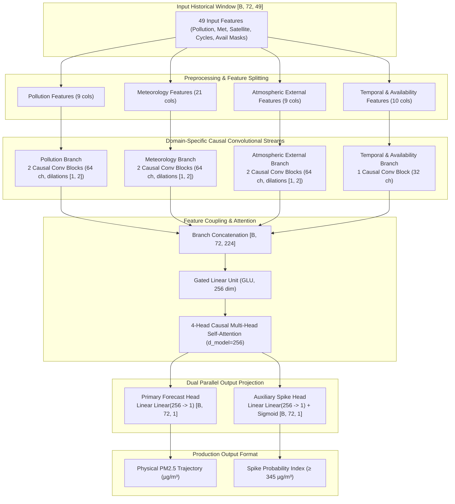

# ATMOSAIR — NEURAL ARCHITECTURE SPECIFICATION & DIAGRAM

> **Model Class:** `CoupledMultiBranchForecastModel`  
> **Total Parameters:** `819,874` parameters (100% trainable)  
> **Input Shape:** `[Batch, 72, 49]` (72 historical hours, 49 features)  
> **Output Shape:** `[Batch, 72, 1]` (72 future PM2.5 forecast hours)  

---

## 1. High-Level System Flow Diagram



---

## 2. Text Architectural Summary

```
Input Sequence: [B, 72, 49]
  ├── Pollution Branch    : [B, 72,  9] ──> Conv1D Blocks ──> [B, 72, 64]
  ├── Meteorology Branch  : [B, 72, 21] ──> Conv1D Blocks ──> [B, 72, 64]
  ├── External Sat Branch : [B, 72,  9] ──> Conv1D Blocks ──> [B, 72, 64]
  └── Temporal Branch     : [B, 72, 10] ──> Conv1D Block  ──> [B, 72, 32]
                                                                  │
                                 Concatenation ───────────────────┘ [B, 72, 224]
                                      │
                         Gated Linear Unit (GLU) ─────────────────> [B, 72, 256]
                                      │
                     4-Head Causal Self-Attention ────────────────> [B, 72, 256]
                                      │
                 ┌────────────────────┴────────────────────┐
                 ▼                                         ▼
       Primary Forecast Head                     Auxiliary Spike Head
        Linear Projection                         Linear + Sigmoid
           [B, 72, 1]                                [B, 72, 1]
```
